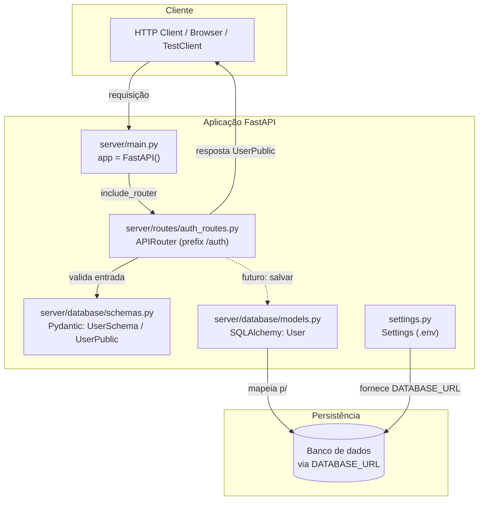
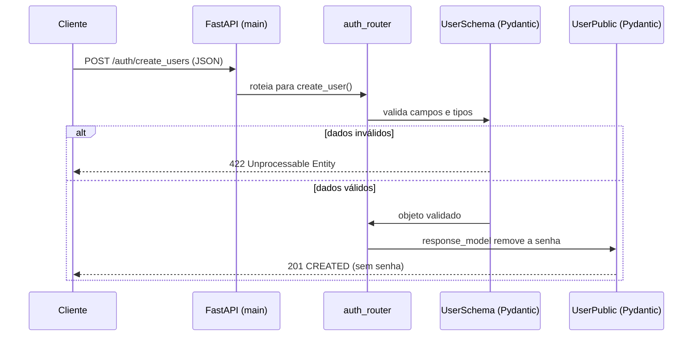
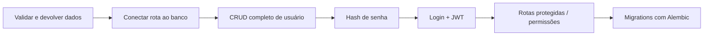

# Resumo de Estudos — API com FastAPI

> Material de estudo consolidando **tudo** o que foi construído neste projeto até
> agora. Serve como mapa mental: parte da visão geral, passa pela arquitetura,
> pelo fluxo de uma requisição e detalha arquivo por arquivo, terminando com um
> roteiro do que já foi aprendido e o que vem a seguir.

---

## 1. Visão geral

Uma API de **autenticação/usuários** construída com o *stack* Python moderno,
com foco em **aprender o ecossistema completo** (não só o FastAPI):

| Camada | Ferramenta | Papel |
|--------|-----------|-------|
| Framework web | **FastAPI** | Cria a API, rotas e documentação automática |
| Servidor ASGI | **uvicorn** | Sobe e executa a aplicação |
| Validação / contratos | **Pydantic** | Valida entrada e serializa saída (schemas) |
| Persistência (ORM) | **SQLAlchemy 2.0** | Mapeia classes Python ↔ tabelas do banco |
| Configuração | **pydantic-settings** | Lê variáveis de ambiente do `.env` |
| Gerenciador de projeto | **uv** | Python, venv e dependências |
| Automação de tarefas | **taskipy** | Atalhos `task run/lint/test/format` |
| Lint + Format | **ruff** | Qualidade e padronização de código |
| Testes | **pytest** + **pytest-cov** | Testes e cobertura |
| Cliente de teste | **httpx** / TestClient | Testa a API sem subir servidor real |

Requisitos: **Python >= 3.13**.

---

## 2. Mapa da arquitetura



> Hoje a rota `create_user` ainda **não grava no banco** — ela apenas valida com
> `UserSchema` e devolve `UserPublic`. O `models.py` e o `settings.py` já estão
> prontos para o próximo passo: conectar as rotas ao SQLAlchemy.

---

## 3. Fluxo de uma requisição (criar usuário)



O ponto-chave: **entra `UserSchema` (com senha), sai `UserPublic` (sem senha)**.
O `response_model=UserPublic` garante que a senha nunca vaza na resposta.

---

## 4. Estrutura de pastas

```
fastapi_1/
├── server/                     # código da aplicação
│   ├── main.py                 # ponto de entrada: cria app e inclui routers
│   ├── routes/
│   │   └── auth_routes.py       # rotas /auth (home, create_users)
│   └── database/
│       ├── models.py            # modelos ORM (tabela User)
│       └── schemas.py           # schemas Pydantic (entrada/saída)
├── test/                       # testes automatizados
│   ├── conftest.py             # fixtures compartilhadas (client, session, mock)
│   ├── test_app.py             # testes de integração (HTTP)
│   ├── test_db.py              # testes unitários do ORM
│   └── users/
│       └── test_create_user.py  # reservado p/ testes de criação de usuário
├── docs/                       # documentação de estudo
│   ├── comandos-uv-task-ruff.md # guia de uv, taskipy e ruff
│   └── resumo-estudos.md        # (este arquivo)
├── settings.py                 # configurações via .env (DATABASE_URL)
├── pyproject.toml              # dependências, ruff, pytest e tasks
├── CLAUDE.md                   # guia/regras do projeto
└── .env                        # variáveis de ambiente (não versionar)
```

---

## 5. Detalhe por arquivo

### `server/main.py` — ponto de entrada
- Cria a instância principal: `app = FastAPI()`.
- Acopla as rotas: `app.include_router(auth_router)`.
- É o que o uvicorn executa: `uvicorn server.main:app --reload`.

### `server/routes/auth_routes.py` — rotas de autenticação
- `auth_router = APIRouter(prefix='/auth', tags=['Autenticação'])` agrupa as rotas.
- `GET /auth/` → `home()`: retorna `{'mensagem': 'Olá mundo!'}` (status 200).
- `POST /auth/create_users` → `create_user()`: recebe `UserSchema`, responde
  `UserPublic` (status 201). Ainda usa uma lista `database = []` em memória.

### `server/database/schemas.py` — contratos Pydantic
- `UserSchema` (**entrada**): email, nome, senha, is_ativo, is_admin, time.
- `UserPublic` (**saída**): igual, mas **sem `senha`** → protege a senha.
- `EmailStr` valida automaticamente se o email é válido.

### `server/database/models.py` — modelo ORM
- `User` mapeada para a tabela `users` via `@table_registry.mapped_as_dataclass`.
- Colunas: `user_id` (PK autogerada), `user_email` (único), `user_name`,
  `user_password`, `is_ativo`, `is_admin`, `user_time`, `created_at`
  (default = `func.now()` no servidor).

### `settings.py` — configuração
- `Settings(BaseSettings)` lê o `.env` (`env_file='.env'`).
- Expõe `DATABASE_URL` para conectar ao banco.

### `test/conftest.py` — fixtures do pytest
- `client`: `TestClient(app)` para testar a API sem servidor real.
- `session`: engine **SQLite em memória**, cria/derruba as tabelas por teste.
- `return_mock`/`_db_time_fake`: força `created_at` fixo (testes determinísticos).

### `test/test_app.py` — testes de integração (padrão AAA)
- `test_home`: GET `/auth` → 200 + mensagem esperada.
- `test_create_user`: POST `/auth/create_users` com payload válido → 201.

### `test/test_db.py` — teste unitário do ORM
- Cria um `User`, grava na `session`, lê de volta e compara com `asdict(user)`.

---

## 6. Comandos do dia a dia

```bash
task run      # sobe a API  -> uvicorn server.main:app --reload
task lint     # ruff check .
task format   # ruff format .
task test     # pytest -s -x --cov=server -vv
```

Detalhes das *tasks* (do `pyproject.toml`):
- `pre_run = 'task lint'` → sempre roda o lint antes de subir a API.
- `pre_test = 'task lint'` e `pre_format = 'ruff check --fix .'` → encadeamento
  automático via `pre_<task>`.

Configuração do ruff: `line-length = 79`, aspas simples, regras
`['I', 'F', 'E', 'W', 'PL', 'PT']`.

> Guia completo de uv / taskipy / ruff em
> [comandos-uv-task-ruff.md](comandos-uv-task-ruff.md).

---

## 7. Conceitos aprendidos até aqui

- **FastAPI**: `FastAPI()`, `APIRouter` com `prefix`/`tags`, rotas `async`,
  `status_code` e `response_model`.
- **Pydantic**: modelos de entrada vs. saída, validação automática, `EmailStr`,
  proteção de dados sensíveis via schema de resposta.
- **SQLAlchemy 2.0**: API declarativa moderna (`Mapped`, `mapped_column`,
  `registry`, `mapped_as_dataclass`), PK autogerada, `unique`, defaults do servidor.
- **pydantic-settings**: configuração 12-factor via `.env`.
- **pytest**: padrão **AAA** (Arrange, Act, Assert), fixtures, `conftest.py`,
  `TestClient`, banco em memória e mock de tempo com eventos do SQLAlchemy.
- **Tooling**: uv (ambiente/deps), ruff (lint+format), taskipy (atalhos),
  pytest-cov (cobertura).

---

## 8. Próximos passos sugeridos



1. **Persistência real**: injetar a `session` do SQLAlchemy nas rotas e gravar o
   usuário de verdade (substituir a lista `database = []`).
2. **CRUD**: listar, buscar por id, atualizar e deletar usuários.
3. **Segurança**: nunca salvar senha em texto puro — usar hash (ex.: `pwdlib`/
   `bcrypt`), validar email duplicado.
4. **Autenticação**: endpoint de login que devolve **JWT** e rotas protegidas.
5. **Migrations**: adotar **Alembic** para versionar o schema do banco.
6. **Testes**: completar `test/users/test_create_user.py` (email duplicado,
   campos inválidos, senha ausente).

<!--
========================= DOCUMENTAÇÃO DO ARQUIVO =========================
Utilidade:
    Documento de estudo que consolida todo o conhecimento e o código
    construído no projeto até o momento. Funciona como um mapa: visão geral
    do stack, diagramas de arquitetura e de fluxo de requisição, estrutura
    de pastas, resumo arquivo por arquivo, comandos, conceitos aprendidos e
    roteiro de próximos passos.

Imports:
    Não se aplica (arquivo Markdown).

Classes:
    Não se aplica.

Funções:
    Não se aplica.
==========================================================================
-->
